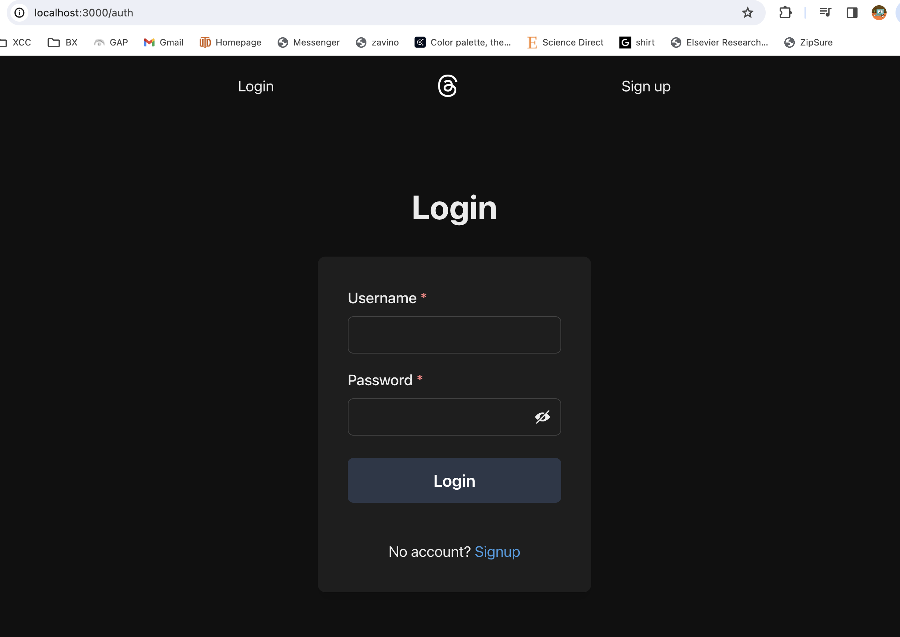
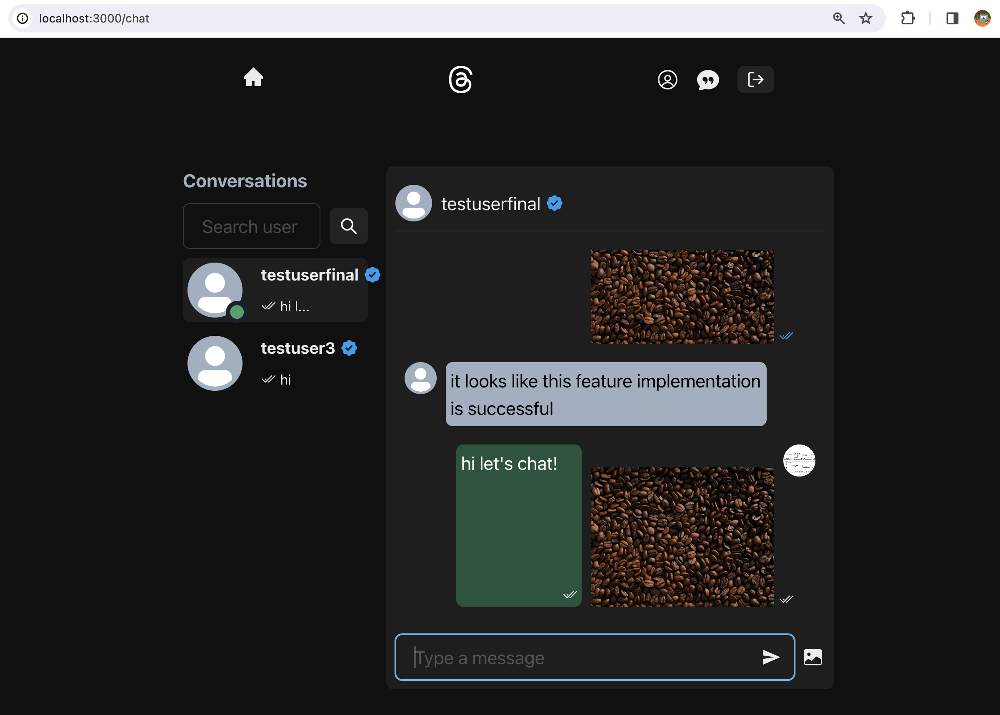

# Threads Clone

Threads clone is a MERN stack web app inspired by Threads launched by Meta. The core functionalities are as follows:

- Signup/Login
- Real-time chat: supporting sending pics, message read/unread, user online/offline real-time displaying
- Create posts with pics, like/unlike posts, comment posts
- Profile management

## App Walkthrough

### Login Page

### Chat Page

The real-time communication was achieved by the socket server. The app can also display the online/offline state of the clients. The clients can also see if the sent messages have already been read.

#### Real-time Online/Offline State Display

##### The Client to Be Chatted with Offline

##### The Client to Be Chatted with online

#### Real-time Chat with Pics

##### Sent A Message, Unread

##### Sent A Message, Another Client Received and Read the Message

##### Another Client Replied

### Post Page

#### Create A New Post with Pics

#### Commenting

### User Profile Page

The clients can change the bio, name, avator and password in the profile page

